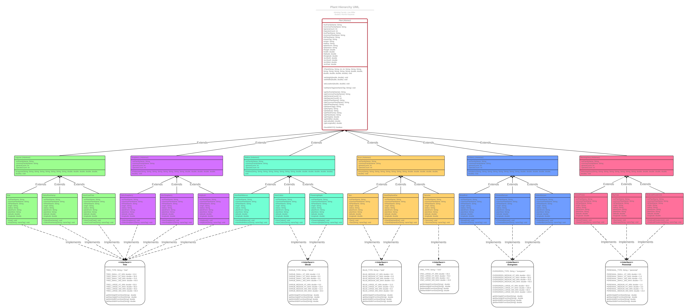

# Modeling Hawaiian Plants as a Java Class Heirarchy for Aina-Based Learning
#### Advising Faculty: Lisa Miller | Student: Ronnie Kaunaoe

## Purpose

[INSERT TEXT HERE]

## Development

[INSERT TEXT HERE]

## Future Applications

[INSERT TEXT HERE]

## Plants Modeled

### Legume (_Fabaceae_)

* Koa (_Acacia koa_)
* Oahu Riverhemp (_Sesbania tomentosa_)
* Hawaiian Coral Tree (_Erythrina sandwicensis_)

### Soapberry (_Sapindus_)

* Oahu Soapberry (_Sapindus oahuensis_)
* Hawaiian Soapberry (_Sapindus saponaria_)
* Hopbush (_Dodonaea viscosa_)

### Mallow (_Malvaceae_)

* Hawaiian Red Hibiscus (_Hibiscus kokio_)
* Hawaiian Cotton (_Gossypium tomentosum_)
* Flowering Maple (_Abutilon menziesii_)

### Arum (_Araceae_)

* Taro (_Colocasia esculenta_)
* Giant Elephant Ear (_Alocasia macrorrhiza_)
* Tarovine (_Monstera deliciosa_)

### Mulberry (_Moraceae_)

* Breadfruit (_Atrocarpus altilis_)
* Chinese Banyan (_Ficus microcarpa_)
* Indian Banyan (_Ficus benghalensis_)

### Morning Glory (_Convolvulaceae_)

* Sweet Potato (_Ipomoea batatas_)
* Bayhops (_Ipomoea pes-caprae_)
* Oval-Leaf Clustervine (_Jacquemontia sandwicensis_)

***Credit to Kapiolani Community College Botany Instructor [Mike Ross](https://www.kapiolani.hawaii.edu/directory/mikeross/), [Native Plants Hawaii](http://nativeplants.hawaii.edu/), [Missouri Botanical Gardens](http://www.missouribotanicalgarden.org/), and [Encyclopedia Britannica](https://www.britannica.com/) for plant information and [Wikimedia Commons](https://commons.wikimedia.org/wiki/Main_Page) for plant images.***
